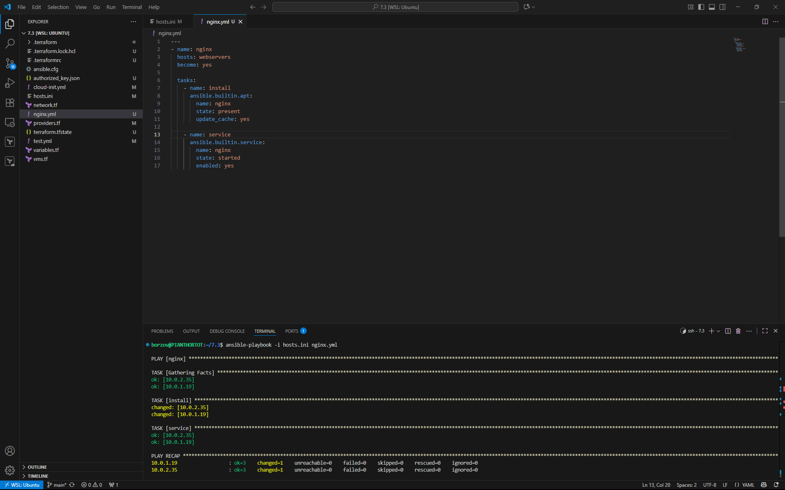
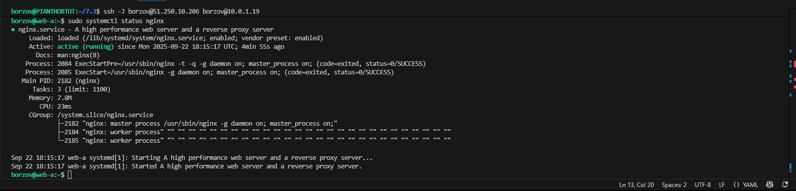
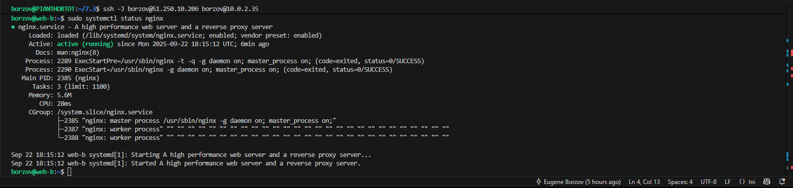

# Домашнее задание к занятию «Подъём инфраструктуры в Yandex Cloud - Евгений Борзов»

---

### Задание 1 

Повторить демонстрацию лекции(развернуть vpc, 2 веб сервера, бастион сервер)

### Задание 2 

С помощью ansible подключиться к web-a и web-b , установить на них nginx.(написать нужный ansible playbook)

Провести тестирование и приложить скриншоты развернутых в облаке ВМ, успешно отработавшего ansible playbook. 

